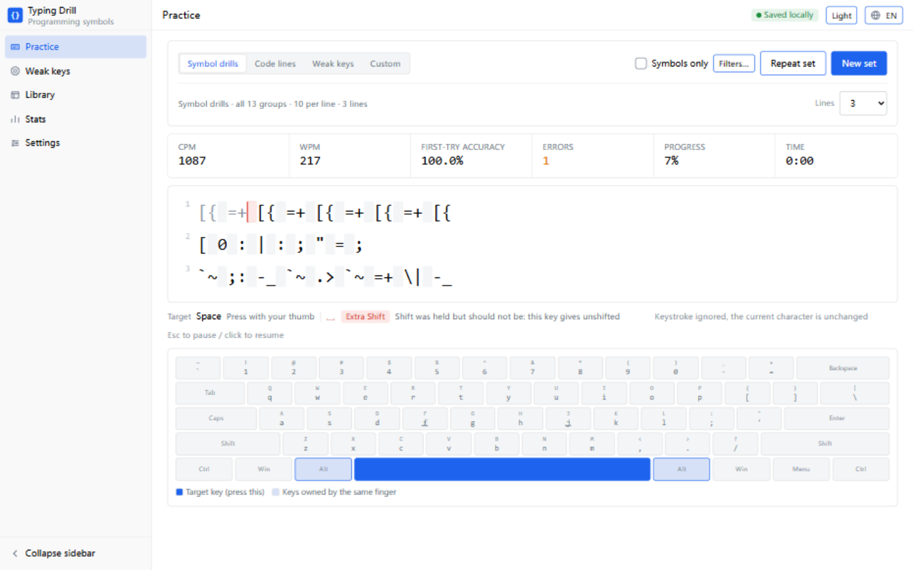

# typing-drill

A typing trainer for **programming symbols**. Zero-dependency static pages: plain HTML/CSS/JS, no build step, no package manager, works offline. Language: **English · [中文](README.zh-CN.md)** <!-- i18n-check-allow: language names are written in their own script -->



---

## Why this exists

Typing sites like monkeytype or typing.com drill English words, which does little for people who write code. The real bottleneck sits in the symbol keys — `{}` `[]` `<>` `->` `=>` `&&` `||` `::` `$ @ # ~` — and in switching between the two layers of the same key.

This tool does four things a general typing test does not.

### 1. Symbols grouped by which finger has to move

`{ } | \ ; : ' " / ?` all live under the right pinky; `! @ # ` ~` under the left. The pinkies carry most of the programming symbol load and are almost always the weakest fingers. The 13 practice groups are organised by finger and key layer rather than by character table, and the on-screen keyboard highlights not just the target key but **the whole region that finger owns**.

### 2. Shift mistakes classified separately

The engine reads both `event.key` (the character produced) and `event.code` (the physical key), so it can tell these apart:

| Mistake | Example | Meaning |
|---|---|---|
| Wrong key | want `{`, typed `]` | hand position was off |
| Missing Shift | want `{`, typed `[` | right key, Shift not held |
| Extra Shift | want `[`, typed `{` | right key, Shift held by mistake |
| Wrong Shift side | typed `{` with right Shift | correct character, wrong technique — reported, not penalised |
| Caps Lock on | want `a`, typed `A` | named explicitly so you do not blame your fingers |

It also tells you which hand should hold Shift: **always the opposite pinky** (left-hand keys take right Shift and vice versa), and lights that Shift key up on the on-screen keyboard.

### 3. A symbols-only mode

Letters and digits dim out and are skipped automatically, so you only press symbol keys. CPM is then computed over symbols only. Maximum symbol density, no interruption from words.

### 4. Weak-key drills driven by your own mistakes

Per-key error rates and response times are recorded, ranked, and turned into practice:

- **back-and-forth rows** built from your weakest symbols — including the *other layer of the same physical key*, because missing-Shift mistakes can only be trained by contrasting the two layers;
- **real code lines** from the snippet library that actually contain those characters.

The code lines are a guarantee rather than a probability: half the slots in a weak-key drill are reserved for lines containing a weak character, because a purely weighted draw can miss them for a whole round and leave the drill as filler.

---

## Quick start

**Option 1 — open `index.html` directly.** No installation. If your browser blocks local storage on `file://` URLs, a notice appears at the top of the page and practice records last only for that page view; you can export a JSON backup at any time from *Settings → Data*.

**Option 2 — run the local server.** `start.cmd` on Windows, `./start.sh` on macOS/Linux. This serves the page from `http://127.0.0.1:8777/` so it has a normal origin and practice records persist. Close the window (or press Ctrl+C) to stop.

> Both work. The only difference is **whether records are kept**. If you want the per-key statistics and weakness ranking to accumulate, use option 2.

## How to practise

1. Open the **Practice** view and leave the mode on *Symbol drills*. All 13 groups are selected by default; use *Filters…* to narrow it down (starting with **Right pinky region** is a good idea).
2. Click the practice area and start typing. The target key is highlighted in the accent colour; the rest of its finger region is light blue.
3. When you press the wrong key, the status row explains what went wrong and which finger should have been used. The cursor does not advance; just type the character correctly.
4. Finishing a set shows a result card: CPM, accuracy, an error breakdown, and the characters you confuse most.
5. After a few rounds, open **Weak keys** — it names your weakest keys and builds drills around them.
6. **Stats** has the per-key table, per-finger error rates, a per-key heatmap, and a speed/accuracy trend.

## The four modes

| Mode | Content | Use it for |
|---|---|---|
| **Symbol drills** | 13 groups, multi-select, adjustable symbols per line | Everyday practice; also for attacking one finger region |
| **Code lines** | 214 hand-written real statements across five language families (JS/TS including JSON and JSX, Python, Shell, Go, SQL) | Practising symbols in meaningful context |
| **Weak keys** | Generated from your own per-key data | Most valuable after a few rounds |
| **Custom** | Paste code you have at hand, or import a `.txt`/`.js`/`.py`/`.sql` file | Practising your own codebase's style |

## What the numbers mean

- **CPM** — characters per minute. Symbols favour character counts over word counts, so CPM is the primary figure; WPM is derived as CPM ÷ 5.
- **First-try accuracy** — the share of characters you got right on the first press. More telling than overall accuracy.
- **Raw accuracy** — correct presses ÷ all presses. Retyping after Backspace counts in both, so it can never exceed 100%.
- **Median response time** — the median rather than the mean, because one distraction is enough to drag an average far off.
- **Idle handling** — gaps over 2 seconds are excluded from response-time samples, and gaps over 5 seconds are excluded from the clock. Walking away mid-drill therefore freezes the timer instead of destroying your CPM. Both thresholds are at the top of `js/engine.js`.
- **Weakness score** — 70% error rate + 30% slowness, scaled by sample confidence. A key you have never got wrong and that is not slow is *not* a weakness: practised is not the same as weak.

## Data and privacy

- Practice records live only in **this computer's browser local storage**, under the key `typing-drill/v1`.
- The tool **makes no network requests at all**: fonts come from the system font stack, there is no CDN, no analytics, no telemetry. It works fully offline.
- A corrupt save is copied to `typing-drill/v1.corrupt` before a fresh state starts; user data is never silently destroyed.
- Export and import are plain JSON. Merging is supported, and importing the same file twice is detected and skipped so statistics cannot silently double.

## Project layout

```
typing-drill/
├── index.html              entry point; script order IS the dependency order
├── start.cmd / start.sh    optional local static server launchers
├── css/tokens.css          design tokens — the single source of values
├── css/app.css             layout and components, tokens only
├── js/i18n.js              translation runtime
├── js/locales/             zh-CN.js and en.js dictionaries
├── js/util.js              helpers + seedable RNG
├── js/keymap.js            US QWERTY key map, finger mapping, mistake classification
├── js/content.symbols.js   13 symbol groups and drill generation
├── js/content.snippets.js  the code-line library
├── js/engine.js            typing engine: verdicts, mistake kinds, timing
├── js/stats.js             aggregation: per-key, per-finger, heat buckets, trend
├── js/store.js             persistence: probe and degrade, import/export
├── js/adaptive.js          weakness ranking and drill generation
├── js/keyboard.js          on-screen keyboard: finger guidance and heatmap
├── js/charts.js            hand-written SVG trend chart
├── js/ui.js                theme, icons, toasts, modal
├── js/views.js             the five views
├── js/main.js              boot and shell
├── docs/I18N.md            how the bilingual setup works, reusable elsewhere
└── tests/                  cases.js, validate.js (Node), test.html (browser)
```

## Tests

```bash
node tests/validate.js
```

Covers key-map completeness, the typeability of every character in the content library, engine mistake classification, statistics definitions (with hand-computed fixtures), storage degradation and import de-duplication, adaptive scoring monotonicity, and the translation layer. Currently **66 cases / 593 assertions, all passing** (one DOM-only case is skipped under Node).

Open `tests/test.html` in a browser to run the same cases; anything the browser cannot support is reported as *skipped* rather than as a failure.

The Node runner also performs static checks:

- both dictionaries carry exactly the same keys, so a half-translated release fails the suite;
- every dictionary key referenced from source exists;
- **no CJK character appears anywhere outside `js/locales/`** — a single rule that catches both untranslated interface strings and untranslated comments. A line can opt out with an explicit `i18n-check-allow` marker.

## Extending it

**Add code lines** — edit the `lines` array of a pack in `js/content.snippets.js`. Re-run the suite afterwards: an assertion requires every character in the library to be typeable on a US keyboard, so CJK comments, full-width punctuation and tabs are all rejected.

**Add a symbol group** — edit `GROUPS` in `js/content.symbols.js`. The character set, the fingers involved and the Shift ratio are derived automatically. Tokens may be multi-character (`->`, `===`).

**Use a different keyboard layout** — replace `ROWS` and the finger assignments in `js/keymap.js`. Everything else (mistake classification, finger guidance, heatmap, statistics) reads from that one table.

**Tune the pacing** — theme, text size, line count, symbols-only and strict mode are in *Settings*. The remaining defaults are in `DEFAULT_SETTINGS` in `js/store.js`.

## Known limitations

- **US QWERTY only.** Other layouts place symbols differently, so the finger guidance would be wrong (`ROWS` is replaceable).
- **Only printable ASCII typeable on a US keyboard.** CJK, full-width punctuation and tabs cannot be drilled — they need an input method editor or special keys and would stall the drill. The library view checks pasted content and the test suite enforces it.
- **Shift-side detection requires you to actually press Shift.** When Caps Lock is used for uppercase, which side was pressed cannot be determined.
- **No mobile support.** Phone keyboards expose neither `event.code` nor a Shift side.
- **The on-screen keyboard needs about 660px**; narrower windows scroll horizontally.
- **Whether `file://` allows local storage depends on the browser.** Only the served path has been verified in this repository's development; when opened directly, the page detects a blocked local store, says so, and offers an export.

## Languages

The interface and documentation are bilingual (English and Chinese). The language follows the browser by default and can be changed in *Settings → Appearance* or with the top-bar switch; the choice is remembered.

The code itself — comments, test names, assertion messages — is English, so the repository reads as an English-language project with a localised interface. See [docs/I18N.md](docs/I18N.md) for the approach and why it is built the way it is.

## Design

The interface follows a flat, dense "tool" design language: a single accent colour (`#1D63ED`), 14px body text, corner radii capped at 8px, no shadows (hierarchy comes from hairlines and whitespace), and complete light and dark themes. All values live in `css/tokens.css`; no component hardcodes a colour.

Two deliberate deviations from that spec, both functional:

1. **Practice text defaults to 28px**, above the 24px cap of the type scale, because typing text has to stay readable at a distance. It is adjustable from 20–32px in settings.
2. **Finger guidance uses shades of the accent colour only** (target / same finger region / everything else), rather than a multi-colour finger palette, which the design language forbids as decorative colour. The heatmap uses the semantic success/warning/error colours, which it permits.

## License

[MIT](LICENSE)
